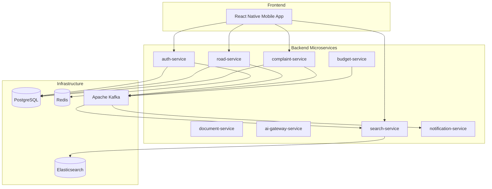
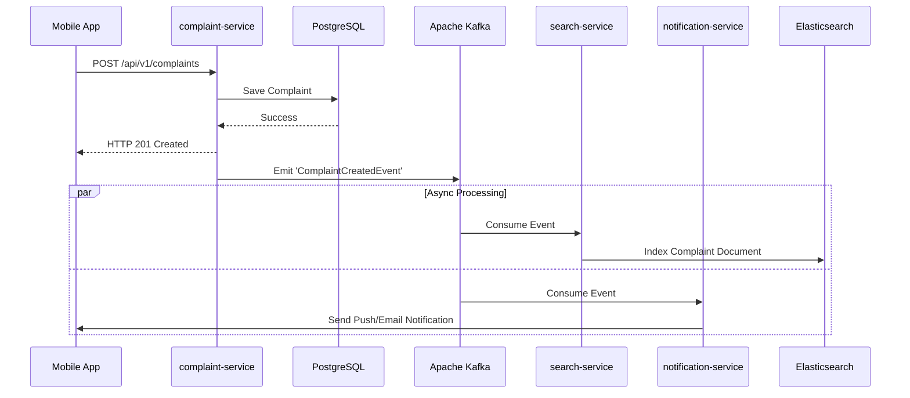
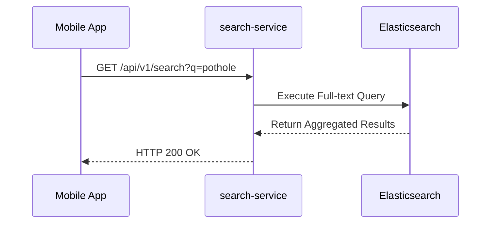

# RoadWatch Detailed Application Architecture & Operation Guide

This document provides an exhaustive, in-depth overview of the RoadWatch application architecture, focusing on microservices structure, asynchronous communication (Kafka), search indexing (Elasticsearch), end-to-end data flows, and infrastructure operation.

---

## 1. System Overview

RoadWatch is designed as an event-driven microservices ecosystem using a **NestJS Monorepo** on the backend and a **React Native (Expo)** mobile frontend. 

The architecture ensures that services remain decoupled, scalable, and highly available, primarily relying on **Apache Kafka** for asynchronous data synchronization and **Elasticsearch** for high-performance cross-domain querying.

### High-Level Architecture Diagram



---


## 2. Infrastructure Layer

All infrastructure components are containerized and orchestrated via `docker-compose.yml`.

| Service | Version | Role in Architecture |
| :--- | :--- | :--- |
| **PostgreSQL** | `15-alpine` | The primary relational datastore. Each microservice manages its own logical database or tables, adhering to the database-per-service pattern. |
| **Redis** | `7-alpine` | Fast, in-memory caching for session management, API rate limiting, and short-lived UI tokens. |
| **Zookeeper & Kafka** | `7.4.0` | The backbone of inter-service communication. Kafka provides durable event streaming, allowing services to react to state changes asynchronously. |
| **Elasticsearch** | `8.13.0` | Centralized search engine. It aggregates data from multiple PostgreSQL databases into flattened documents optimized for full-text search and complex filtering. |

---

## 3. Microservices Breakdown

The NestJS monorepo (`apps/`) contains the following 8 specialized microservices. All services share standard libraries (like the `KafkaModule`) from the `libs/common/` directory.

### 3.1 Domain Services (Producers)
These services act as the **Source of Truth** for their respective domains. They handle direct CRUD operations, store data in PostgreSQL, and publish events to Kafka.

1. **`auth-service` (Port: 3007)**
   - **Role:** User authentication, JWT issuance, and RBAC (Role-Based Access Control).
   - **DataFlow:** Validates credentials against PostgreSQL, caches active sessions in Redis.

2. **`road-service` (Port: 3001)**
   - **Role:** Manages road metadata, conditions, and geographical mappings.
   - **Kafka Usage:** Emits events to the `road-updates` topic (e.g., `RoadCreatedEvent`) whenever road infrastructure is added or modified.

3. **`budget-service` (Port: 3002)**
   - **Role:** Financial tracking, contractor management, and project funding.
   - **Kafka Usage:** Emits events to the `budget-updates` topic (e.g., `BudgetUpdatedEvent`).

4. **`complaint-service` (Port: 3003)**
   - **Role:** Ingests citizen reports and tracks complaint lifecycles.
   - **Kafka Usage:** Emits events to the `complaints` topic (e.g., `ComplaintCreatedEvent`, `ComplaintStatusUpdated`).

5. **`document-service` (Port: 3004)**
   - **Role:** Handles file uploads (images, PDFs) and returns storage references (URIs) to other services.

6. **`ai-gateway-service` (Port: 3006) & `RoadWatch-AI`**
   - **Role:** Interacts with AI models (e.g., image analysis for road damage detection using YOLOv8). The `RoadWatch-AI` repository contains Python-based machine learning pipelines, including a model (`yolov8n.pt`) and an orchestrator deployed via Kubernetes (`orchestrator-deployment.yaml`). It leverages `pgvector` for advanced similarity search.
   - **Kafka Usage:** Connects to Kafka via `KafkaModule` to asynchronously trigger model inferences based on uploaded media or newly created complaints. Extracts metadata and updates the respective PostgreSQL entities.

### 3.2 Aggregate & Utility Services (Consumers)
These services do not primarily "own" core data; they consume events to perform side effects.

7. **`search-service` (Port: 3005)**
   - **Role:** Provides a unified search API across all domains (Roads, Complaints, Budgets).
   - **Kafka Usage:** Runs a Kafka consumer group (`search-sync-group-v2`). It listens to `road-updates`, `complaints`, and `budget-updates`.
   - **Elasticsearch Usage:** When an event is consumed, it transforms the PostgreSQL entity payload into an Elasticsearch document and indexes it via the `@elastic/elasticsearch` client.

8. **`notification-service` (Port: 3008)**
   - **Role:** Dispatches alerts (email, push, SMS).
   - **Kafka Usage:** Runs a Kafka consumer group (`notification-group`). It listens to topics like `complaints` and triggers notifications (e.g., emailing a citizen when their `ComplaintStatusUpdated`).

---

### 3.3 Security & Authentication Architecture
- **JWT-Based Authentication:** `auth-service` issues JWT access tokens upon successful login.
- **RBAC (Role-Based Access Control):** Centralized via the `@Roles()` decorator and `RolesGuard` in the shared `libs/common/src/security` library. Endpoints are strictly protected based on user roles (e.g., Admin, Contractor, Citizen).

### 3.4 Data Storage & Persistence Strategy
- **Database-per-Service:** Each domain service (Road, Budget, Complaint) connects to its own logical database schema within the PostgreSQL cluster, preventing cross-domain tight coupling.
- **Shared Entities:** Base entity structures (like ID generation and timestamps) are standardized in `libs/common/src/database/base.entity.js`.
- **Vector Search:** The AI stack relies on `pgvector` enabled in PostgreSQL (configured via Kubernetes manifests in `RoadWatch-AI/k8s`) for semantic and similarity queries.

---

## 4. Deep Dive: Kafka & Elasticsearch Data Flow

The use of Kafka and Elasticsearch is central to RoadWatch's CQRS-like architecture. By separating writes (to PostgreSQL via Domain Services) from reads (via Elasticsearch in Search Service), the system can scale heavily on read requests.

### Example Data Flow: Citizen Submits a Complaint

1. **User Action (Frontend):** 
   - The user submits a pothole complaint via the React Native mobile app (`road_frontend/mobile`).
2. **Synchronous API Write (`complaint-service`):**
   - The mobile app sends a POST request to `http://localhost:3003/api/v1/complaints`.
   - The `complaint-service` validates the input and persists it synchronously to its PostgreSQL database.
   - A success response (HTTP 201) is returned to the user immediately.
3. **Asynchronous Event Publishing (Kafka):**
   - Using the `KafkaService` (`libs/common/KafkaModule`), `complaint-service` emits a `ComplaintCreatedEvent` to the `complaints` Kafka topic.
4. **Asynchronous Event Consumption (`search-service`):**
   - The `search-service` (`search.consumer.js`) constantly polls Kafka.
   - It picks up the `ComplaintCreatedEvent`.
   - Using the `ElasticsearchService`, it executes an index request (e.g., `this.client.index(...)`) to store a denormalized version of the complaint in the Elasticsearch `complaints_index`.
5. **Asynchronous Event Consumption (`notification-service`):**
   - Simultaneously, the `notification-service` (`notification.consumer.js`) picks up the same `ComplaintCreatedEvent`.
   - It parses the payload, identifies the `citizenId`, looks up their contact info, and dispatches a "Complaint Received" push notification or email.

**Data Flow Sequence:**




### Example Data Flow: Global Search

1. **User Action:** The user searches for "Main Street Pothole" in the mobile app.
2. **Synchronous API Read (`search-service`):**
   - The mobile app sends a GET request to `http://localhost:3005/api/v1/search?q=Main+Street+Pothole`.
   - The `search-service` skips PostgreSQL entirely and routes the query directly to Elasticsearch.
   - Elasticsearch performs a high-speed, full-text relevance search across multiple indices and returns the aggregated results instantly.

**Search Data Flow Sequence:**



## 4.1 Error Handling & System Resilience
RoadWatch is designed to be highly resilient against partial system failures:
- **Eventual Consistency:** Since write operations rely on Kafka events, temporary downtime of downstream consumers (`search-service`, `notification-service`) does not break the core domain services. Events are buffered in Kafka and processed once consumers recover.
- **Retry Mechanisms:** Elasticsearch connections and other external API calls implement robust retry and backoff strategies.
- **Decoupled File Storage:** By isolating file uploads in the `document-service`, large binary data flows are kept away from the primary message brokers and transactional databases.

---

## 5. Mobile Frontend Details

The frontend (`road_frontend/mobile`) relies heavily on **Expo** and modern React Native practices.

- **Routing:** Utilizes `expo-router` for file-based navigation, making deep-linking and state preservation easier.
- **UI & Animations:** Uses `react-native-reanimated` (v4.3.1) and `expo-glass-effect` for premium, highly responsive user interfaces.
- **Networking:** Standard `axios` configuration to communicate directly with backend API Gateways/Microservices.
- **Types:** Full TypeScript support (`~6.0.3`) for strict contract enforcement with backend APIs.

---

## 6. How to Run the Entire Application

### 1. Start Infrastructure Dependencies
Before starting the backend, initialize the stateful backing services:
```bash
cd e:\roadwatch\road_backend
docker-compose up -d
```
> **Note:** Elasticsearch (`docker.elastic.co/elasticsearch/elasticsearch:8.13.0`) is heavy. Ensure Docker has >4GB RAM allocated and wait at least 30-60 seconds before starting the NestJS services to prevent connection timeouts (`search-service` will attempt retries).

### 2. Install and Start Backend Services
```bash
npm install
# Start all 8 microservices (Requires 8 available ports from 3001-3008)
.\run_all_services.bat
```

### 3. Run the Mobile Application
Ensure you have the Expo Go app installed on your physical device, or have an Android Emulator / iOS Simulator running.
```bash
cd e:\roadwatch\road_backend\road_frontend\mobile
npm install
npm start
```

### 4. Direct API Testing
The repository provides `RoadWatch.postman_collection.json`. Import this into Postman to directly execute flows (e.g., creating a road, which you can then verify by querying the search service to ensure Kafka/Elasticsearch sync worked).

---

## 7. Deployment & Orchestration Strategy

While the local development environment relies on `docker-compose`, production deployments are orchestrated using **Kubernetes (K8s)**.

- **Helm & Kubernetes:** The application components (especially the `RoadWatch-AI` services and data stores) include K8s manifests (e.g., `orchestrator-deployment.yaml`, `postgres-pgvector.yaml`) for scaling, self-healing, and rolling updates.
- **Stateless Microservices:** All NestJS backend services are fully stateless, meaning they can be scaled horizontally across multiple pods based on CPU/Memory metrics.
- **Managed Backing Services:** In production, standard practice is to replace containerized Kafka, PostgreSQL, and Elasticsearch with managed cloud equivalents (e.g., AWS MSK, Amazon RDS, Elastic Cloud) to guarantee high availability and simplify maintenance.

---

## 8. Detailed Backend Specifications

This section provides an in-depth look at the database entities and the exposed RESTful API surface area for the primary microservices. The backend is written in TypeScript/JavaScript utilizing the NestJS framework and TypeORM for persistence.

### 8.1 Database Schemas & Entities

All entities inherit from a common `BaseEntity` (`libs/common/src/database/base.entity.js`) which typically provides a primary key (`id`), `createdAt`, and `updatedAt` timestamps.

#### 1. User Entity (`auth-service`)
Table Name: `users`
- `email` (varchar 255, unique)
- `password` (varchar 255)
- `name` (varchar 255)
- `role` (varchar 50, default: 'CITIZEN') - Managed by RBAC.
- `refreshToken` (text, nullable)

#### 2. Road Entity (`road-service`)
Table Name: `roads`
- `name` (varchar)
- `category` (enum: 'NH', 'SH', 'MDR', 'Panchayat')
- `geometry` (geometry: LineString, srid: 4326) - Stores the spatial path of the road.
- `authority_name` (varchar)
- `authority_email` (varchar, nullable)
- `contractor_id` (uuid, nullable)

#### 3. Budget Entity (`budget-service`)
Table Name: `budgets`
- `road_id` (int)
- `contractor` (ManyToOne relationship to `Contractor` entity)
- `sanctioned_amount` (numeric 15,2)
- `released_amount` (numeric 15,2, default: 0.00)
- `spent_amount` (numeric 15,2, default: 0.00)
- `currency` (varchar, default: 'INR')
- `tender_reference` (varchar, unique)
- `sanction_date` (date)

#### 4. Complaint Entity (`complaint-service`)
Table Name: `complaints`
- `citizen_id` (varchar)
- `road_id` (int, nullable)
- `location` (geometry: Point, srid: 4326) - Geospatial coordinates of the pothole/issue.
- `description` (text)
- `status` (enum: SUBMITTED, VERIFYING, ASSIGNED, IN_PROGRESS, RESOLVED, CLOSED, ESCALATED_L1, ESCALATED_L2)
- `sla_deadline` (timestamp with time zone)
- `assigned_authority_email` (varchar, nullable)
- `image_url` (varchar, nullable)

---

### 8.2 API Endpoints

Endpoints are protected by `RolesGuard` and `@Roles()` decorators, ensuring that only users with the correct roles (e.g., `CITIZEN`, `GOVERNMENT`, `ADMIN`) can access specific operations.

#### 1. Road Service (`api/v1/roads`)
- `POST /` - Create a new road geometry (Role: `GOVERNMENT`).
- `POST /suggest` - Suggest a road based on coordinates (Roles: `CITIZEN`, `GOVERNMENT`).
- `GET /nearby?lat=&lng=&radius=` - Find nearby roads using PostGIS geospatial queries.
- `GET /` - Retrieve all roads.
- `GET /:id` - Get a specific road.
- `PUT /:id` - Update road details (Role: `GOVERNMENT`).
- `DELETE /:id` - Delete a road (Role: `GOVERNMENT`).

#### 2. Complaint Service (`api/v1/complaints`)
- `POST /` - Submit a new complaint (Roles: `CITIZEN`, `GOVERNMENT`). Includes latitude, longitude, and base64 image data.
- `POST /sync` - Bulk sync offline complaints from the mobile app.
- `PATCH /:id/status` - Update the status of a complaint (Roles: `GOVERNMENT`, `ADMIN`).
- `GET /` - List all complaints.
- `GET /:id` - Get specific complaint details.
- `GET /:id/timeline` - Retrieve the audit/history timeline of a specific complaint.
- `PUT /:id` - Update complaint metadata.
- `DELETE /:id` - Delete a complaint.

#### 3. Budget Service (`api/v1/budgets` - Expected)
Handles CRUD operations for budgets and financial tracking linked to specific roads and contractors.

#### 4. Search Service (`api/v1/search` - Expected)
Exposes cross-domain full-text search capabilities hitting the Elasticsearch cluster instead of the Postgres databases.
